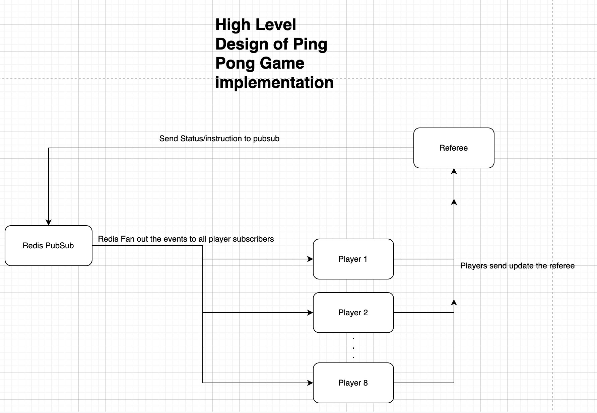

# Ping Pong Game Implementation in python

### Instruction to Run:

In the project root, Run `docker-compose up`

This will create/download all the required images and starts up 1 instance of referee app and 8 instance of player app.

### Project Details:

The Championship match is started immediately when the conatiners are started. Ping Pong Game uses API's implemented using Flask Web Framework and redis pubsub to communicate with each other and keep each other updated through a centralised refree app.

The final report with all match details can be viewed at `report/championship_report.csv` by referee container.

### High level Design:

